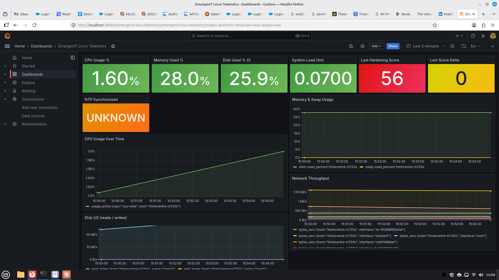
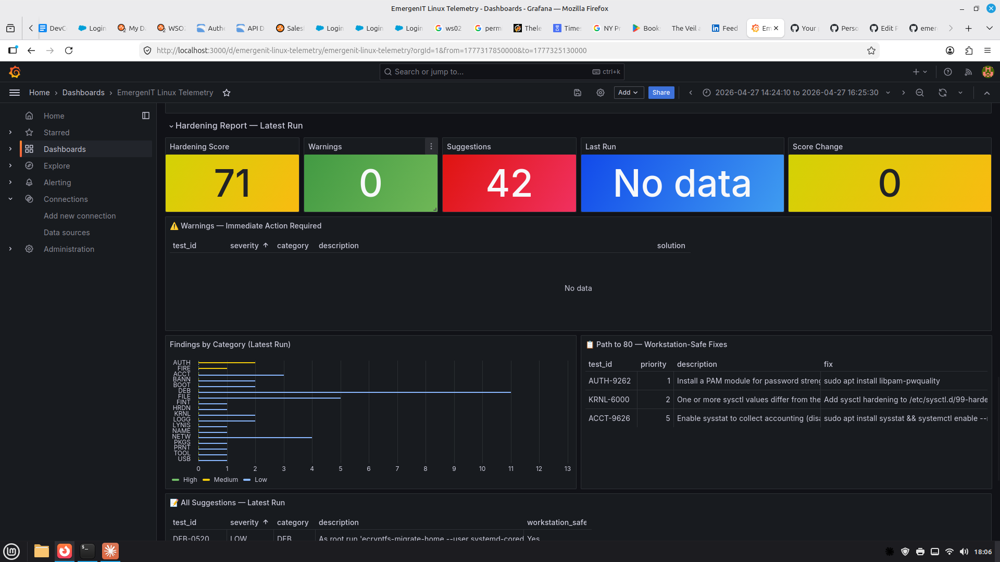

# EmergenIT Linux Telemetry

A fully containerized Linux security auditing and system telemetry stack.
Built on Docker Compose — works on any Ubuntu/Debian host.

**Works with or without Claude Desktop.**

- Run security audits with [Lynis](https://cisofy.com/lynis/)
- Track hardening score trends over time in Grafana
- Monitor CPU, memory, disk, and network in real time via Telegraf + InfluxDB
- Get AI-powered remediation guidance via Claude Desktop (optional)


---

## Quick Start

```bash
# 1. Clone
git clone https://github.com/timaw513/emergenit-linux-telemetry
cd emergenit-linux-telemetry

# 2. First-run setup (generates credentials, detects hostname, starts stack)
chmod +x telem scripts/*.sh
./telem init

# 3. Run your first audit
telem scan

# 4. Open Grafana
telem open   # or visit http://localhost:3000
```

**Requirements:** Docker, Docker Compose v2, Python 3, Ubuntu 22.04+ or Debian 12+

---

## What's in the stack

| Container | Image | Role |
|---|---|---|
| `lt-influxdb` | influxdb:2.7 | Time-series store for system metrics |
| `lt-telegraf` | telegraf:1.30 | Collects CPU, memory, disk, network every 5 min |
| `lt-lynis` | custom | Runs Lynis audits on schedule + on-demand |
| `lt-audit-writer` | custom | Ingests Lynis JSON reports → SQLite |
| `lt-grafana` | grafana/grafana:11 | Dashboards — system health + audit history |

---

## CLI Reference

```bash
telem init                        # First-run setup
telem start / stop / restart      # Stack management
telem status                      # Container health
telem scan                        # Run Lynis audit now (2-3 min)
telem scan-host <n> <user@host>   # Audit a remote host via SSH
telem ingest                      # Force ingestion of pending reports
telem logs [service]              # Tail logs
telem update                      # Pull latest images
telem open                        # Open Grafana in browser
telem install-mcp                 # Wire into Claude Desktop
```

---

## Multi-host auditing

Edit `hosts.yml` (created by `telem init`) to add remote machines:

```yaml
hosts:
  - name: localhost
    address: localhost
    user: user
    local: true

  - name: web-server
    address: 192.168.1.100
    user: ubuntu
    local: false
    ssh_key: ~/.ssh/telem_ed25519
```

Set up SSH key auth for each remote host:
```bash
ssh-keygen -t ed25519 -f ~/.ssh/telem_ed25519
ssh-copy-id -i ~/.ssh/telem_ed25519 ubuntu@192.168.1.100
```

Then audit it:
```bash
telem scan-host web-server ubuntu@192.168.1.100
```

Grafana shows all hosts in the same dashboard with a host filter dropdown.

---

## Claude Desktop Integration (optional)

If you have [Claude Desktop](https://claude.ai/download) installed:

```bash
telem install-mcp
# Then restart Claude Desktop
```

This adds three MCP tools to Claude:

| Tool | What it does |
|---|---|
| `run_audit` | Runs Lynis now, returns score + counts |
| `get_last_report` | Returns all findings with descriptions |
| `get_system_health` | NTP, disk, memory, load, last audit score |

You can then ask Claude things like:
- *"Show me my system health"*
- *"What do I need to fix to improve my hardening score?"*
- *"Run an audit and tell me what changed"*

Claude will call the tools, read the findings, and give you a prioritized remediation plan tailored to whether the machine is a server or workstation.

---

## Grafana Dashboards

Two dashboard sections:

**System Telemetry** — live metrics from Telegraf



Real-time stat cards for CPU, memory, disk, network, system load, and NTP sync status — with time-series graphs for trend analysis.

**Hardening Report** — from Lynis audit history



Hardening score, warnings table with inline fix commands, findings breakdown by category, workstation-safe path-to-80 fix list, and full suggestions table with Yes/Skip/Review classification.

---

## Hardening Score Guide

| Score | Status | Action |
|---|---|---|
| 80–100 | Good | Maintain and monitor |
| 60–79 | Fair | Apply remaining suggestions |
| 40–59 | Poor | Follow remediation plan |
| < 40 | Critical | Immediate action needed |

A score of **75+ is realistic and appropriate for a developer workstation.**
Chasing 90+ requires server-level hardening that creates friction in daily use.

---

## Configuration

All configuration lives in `.env` (generated by `telem init`, never committed to git):

```env
HOST_HOSTNAME=my-machine
INFLUX_USER=admin
INFLUX_PASSWORD=...
INFLUX_TOKEN=...
GRAFANA_USER=admin
GRAFANA_PASSWORD=...
```

To regenerate credentials: delete `.env` and run `telem init` again.

---

## License

MIT — free to use, modify, and distribute.

Built by [EmergenIT](https://emergenit.com).
